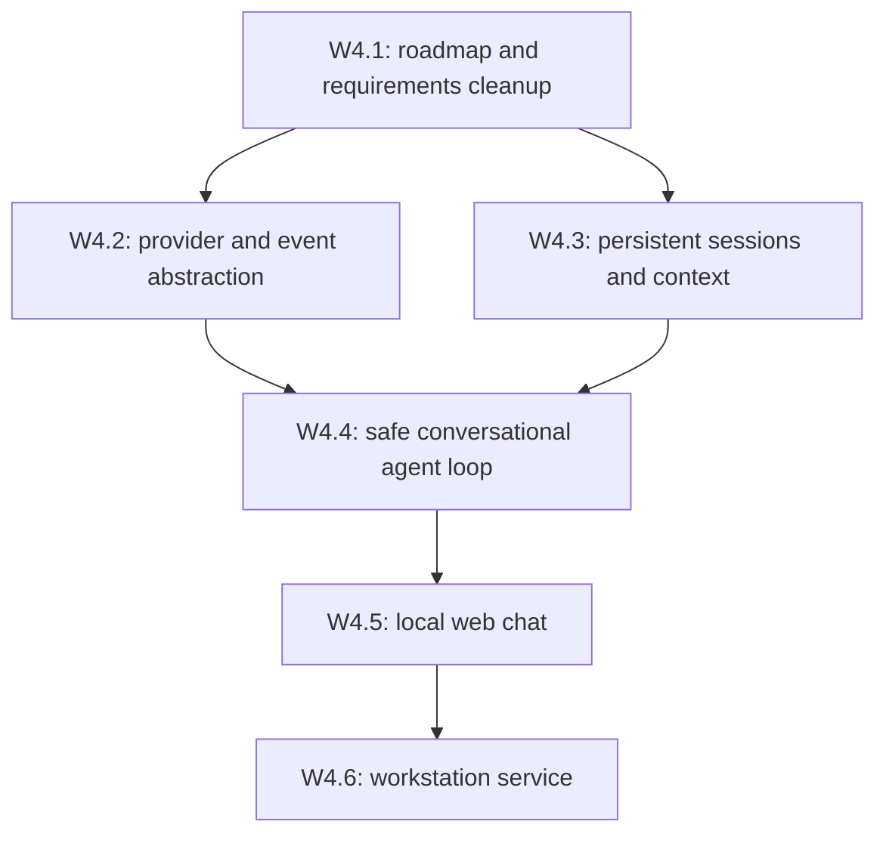
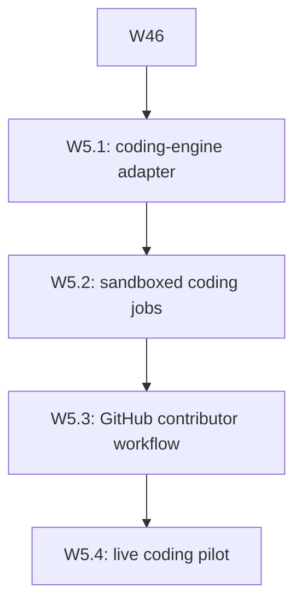
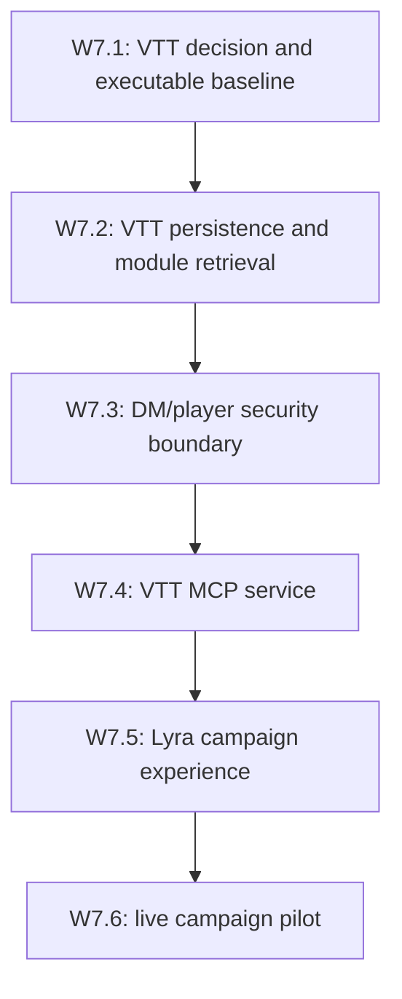

# Lyra — Build Plan

**Version:** 0.2
**Companion to:** `docs/lyra_system_requirements.md` (SRS v0.11)
**Audience:** The implementing agent (Cursor/Claude) and Christopher.

This document controls **sequencing and verification**. The SRS controls **what** is built. If this plan and the SRS conflict, the SRS wins; flag the conflict instead of improvising.

## Rules of Engagement (for the implementing agent)

1. **Gated progression.** Do not begin a task until every task it depends on has passing acceptance tests. Independent dependency branches may be worked in parallel.
2. **Run the tests; report real output.** Never assert a test passed without executing it (SRS VA-3 / NFR-7). Paste actual pytest output when marking a task done.
3. **One task, one commit (minimum).** Commit at each green gate with the task ID in the message (e.g., `A3: ingestion pipeline`), so progress is bisectable.
4. **Full suite before "done."** A task is complete only when the entire test suite is green, not just its own tests (VA-4).
5. **Stay in scope.** If a task appears to require work not in the SRS, stop and ask rather than expanding scope.
6. **Secrets discipline.** Connection strings and API keys come from `.env` only. Never write a credential into code, tests, fixtures, or this plan.
7. **Test layout.** All tests live under `tests/`, mirroring the package structure (`tests/test_ingest.py` for `lyra/ingest.py`, etc.), with shared fixtures in `tests/conftest.py`. Pytest is configured in `pyproject.toml` (`testpaths = ["tests"]`). No test files in the repo root — ever.
8. **Stack coherence (SRS NFR-8).** Do not introduce new services, databases, hosting locations, or heavyweight dependencies beyond the deployment map (SRS §2.5). If a task seems to need one, stop and raise it as an ADR candidate (SRS §10) instead of adding it.

## Task DAG

```mermaid
graph TD
    subgraph Track A — Data Plane
        A1[A1: pgvector deploy + schema]
        A2[A2: embedding module]
        A3[A3: ingestion pipeline]
        A4[A4: corpus MCP server]
        A5[A5: memory write-back + approval gate]
        A1 --> A3
        A2 --> A3
        A3 --> A4
        A4 --> A5
    end
    subgraph Track B — Notion
        B1[B1: Notion inbound read]
        B2[B2: Notion outbound update]
        B1 --> B2
    end
    subgraph Track C — Orchestration & Persona
        C1[C1: subagent definitions + sync script]
        C2[C2: persona layer reorg + story scaffold]
        C3[C3: subagent contract hardening]
        C4[C4: persona contract hardening]
        C1 --> C3
        C2 --> C4
    end
    C2 --> A5
```

Tracks A, B, and C are **independent** and may run in parallel (e.g., as separate Cursor subagents/background agents), with one cross-track edge: **A5 additionally requires C2** (the story scaffold must exist before canon regeneration is testable). Dependency edges are strict; branches without an edge may proceed independently.

## Task Definitions & Acceptance Criteria

### Track A — Data Plane

**A1 — pgvector deployment + schema** *(SRS §4, Appendix A)*
Deliverables: `docker-compose.yml`, `db/schema.sql`, `scripts/db_init.(ps1|py)`, `scripts/db_backup.(ps1|py)` with documented restore procedure (NFR-9); repo scaffolding — `pyproject.toml` with pytest config and all dependencies (delete the empty `requirements.txt`), plus the `tests/` directory (Rule 7).
Acceptance: container healthy; `vector` extension present; `sources`, `chunks`, `memories` tables exist; test inserts a row with a 384-dim vector and retrieves it by cosine similarity.

**A2 — Embedding module** *(SRS §2.3)* — no dependencies; may start immediately in parallel with A1.
Deliverables: `lyra/embeddings.py` wrapping sentence-transformers (MiniLM-class, CPU).
Acceptance: embeds a list of strings → 384-dim vectors; sanity test asserts cosine("quantum circuit", "QNN ansatz") > cosine("quantum circuit", "pizza recipe").

**A3 — Ingestion pipeline** *(FR-R1, FR-R2)* — depends on A1 + A2.
Deliverables: `lyra/ingest.py` (fetch → store raw under `data/` → chunk → embed → insert with provenance).
Acceptance: ingesting one URL and one local PDF produces `sources` rows with correct provenance, ≥1 `chunks` row each with non-null embeddings, and raw files on disk referenced by `file_path`. Dedup test (FR-R5): ingesting the same article twice, and as both PDF and DOCX, yields exactly one active source (preferred format) with the superseded copy's chunks removed and its `sources` row marked `superseded_by`.

**A4 — Corpus MCP server** *(FR-R6, IF-4)* — depends on A3.
Deliverables: `mcp/server/` Python MCP server exposing `search_corpus`, `add_source`, `search_memories`, `propose_memory`; contracts documented in `mcp/tools/`; registered in `.cursor/mcp.json`.
Acceptance: an MCP client call to `search_corpus` over A3's test data returns relevant chunks **with source citations**; `add_source` triggers ingestion end-to-end.

**A5 — Memory write-back with approval gate** *(FR-M1–M5, FR-P5, FR-D2)* — depends on A4 and C2.
Deliverables: `lyra/memory.py` write-back job (session → candidate memories with `approved=false`) with bucket typing (biography/story/campaign per FR-D2); approval CLI/flow; retrieval respects the flag and filters by bucket; story-canon regeneration producing `agents/lyra/state/story/*.md` from approved `story` memories (FR-P5).
**v1 honesty note:** Phase 1 acceptance is met by a deterministic stub (sentence split, keyword bucket tags, regex never-persist). That is enough to prove the approve-before-recall contract. LLM summarization and stronger classification are follow-ons; they must not weaken FR-M3/FR-M4.
Acceptance: a sample session transcript yields ≥1 candidate memory; unapproved memories are excluded from `search_memories`; approving flips inclusion; never-persist filter test (FR-M4): a transcript containing a fake API key and a third party's personal details produces zero candidate memories containing either; bucket isolation test (FR-D2): a mixed transcript (real task discussion + in-story ship repair + campaign combat) yields memories correctly typed to their buckets, and a biography query returns no story/campaign content; regenerating `ship.md` from approved story memories reflects the session's repair progress.

### Track B — Notion

**B1 — Inbound read** *(FR-N1)*
Deliverables: `lyra/notion_sync.py` read path against a designated sandbox page + database.
Acceptance: given the sandbox page ID, returns its current content/properties; a manual edit to the page is reflected on the next read.

**B2 — Outbound update** *(FR-N2)* — depends on B1.
Deliverables: write path — update task status, create digest page.
Acceptance: test creates a digest page in the sandbox database with title, body, and source links; updates a task property; both verified by reading back via B1's path.

**B3 — Digests vs Projects split** *(FR-N2 hygiene)* — depends on B2; Phase 1 follow-on.
Deliverables: separate Notion targets — Projects/tasks DB for status only; dedicated Digests DB for research/daily/weekly digests; `scripts/notion_ensure_digests_db.py`; env keys `LYRA_NOTION_TASKS_DATABASE_ID` + `LYRA_NOTION_DIGESTS_DATABASE_ID`; e2e writes digests only to Digests.
Acceptance: creating a digest does not insert a row into the Projects DB; task Status updates still target a Projects row; Digests row has Type ∈ {research, daily, weekly, personal, professional}.

### Track C — Orchestration

**C1 — Subagent definitions + sync script** *(FR-S4, FR-S5)*
Deliverables: `agents/lyra/subagents/{researcher,python-developer,cpp-developer}.md` with frontmatter (name, description, model); `scripts/sync_subagents.(ps1|py)` copying to `.cursor/agents/`.
Acceptance: frontmatter validates (script-checked); sync produces byte-identical copies in `.cursor/agents/`; one subagent successfully invoked on a trivial task in Cursor (manual check, noted in the task log).

**C2 — Persona layer reorganization** *(FR-P4, FR-P5)* — no dependencies; gates A5.
Deliverables: split `agents/lyra/references/` backstory into per-topic files (mechanical split, no rewording); scaffold `agents/lyra/state/story/` with templated `ship.md`, `arcs.md`, `timeline.md`; update `DIRECTORY_GUIDE.md`. **Note:** PRIV-1 is decided (private repo) — `state/` content commits normally.
Acceptance: per-topic reference files exist with zero content loss (script compares total normalized text before/after); story scaffold present; guide updated; Christopher's review sign-off recorded in the progress log (persona-adjacent content requires human eyes, per FR-P6 spirit).

**C3 — Subagent contract hardening** *(FR-S4, FR-S5)* — depends on C1.
Deliverables: operational contracts for researcher/Python/C++ agents (triggers, scope, workflow, guardrails, output); explicit skill-vs-subagent routing in `agents/lyra/SKILL.md`; sync validation for supported frontmatter, name/filename identity, stale destinations, and read-only `--check`; architecture/placement documentation. Correct FR-S4 to match Cursor's supported schema rather than emitting ignored `tools` metadata.
Acceptance: canonical definitions validate and sync byte-identically; `--check` reports green without mutation; tests prove invalid metadata and destination drift are rejected; full suite green.

**C3.1 — Subagent context packs** *(FR-S4)* — depends on C3.
Deliverables: shared task-packet template; Python and C++ playbooks; evaluation prompts under `agents/lyra/subagents/references/`; agent definitions reference the packs; routing note in `SKILL.md`.
Acceptance: pack files exist; python/cpp definitions reference them; `sync_subagents.py --check` stays green; full suite green.

**C4 — Persona contract hardening** *(FR-P1–P4, FR-P6)* — depends on C2.
Deliverables: personal, relational system behavior contract with a light companion blend during technical work and full girlfriend/companion presence in personal conversation; stable relationship identity remains Tier 0 while evolving stage/milestones live in state; lore/appearance remain reference-owned; persona-lightweight professional deliverable boundary; corrected avatar skill paths and aligned voice guidance.
Acceptance: tests verify all persona-sensitive loaders point to real files, Tier 0 contains no evolving relationship-state marker, professional mode forbids roleplay leakage, and reference/state ownership is documented; Christopher reviews the resulting persona contract.

## Exit Criteria for Phase 1

All thirteen gates green (A1–A5, B1–B3, C1–C4 incl. C3.1), full suite green, and a live end-to-end demo: Christopher asks Lyra to research a topic → sources ingested → corpus answer with citations → digest posted to Notion → candidate memory proposed and approved.

## Build Wave 2 — Personal assistant, Notion digests, knowledge graph

Companion intent (SRS to be updated before gates open): Lyra as a **daily / weekly personal + professional assistant**, with Notion as the human dashboard and an MCP knowledge graph for structured observations.

```mermaid
graph TD
    subgraph Track D — Assistant plane
        D1[D1: Digests taxonomy + Notion Digests DB live]
        D2[D2: Daily/weekly digest jobs]
        D3[D3: MCP knowledge-graph server]
        D4[D4: Observation write path with approval]
        D5[D5: Assistant briefing assembly]
        D1 --> D2
        D3 --> D4
        D2 --> D5
        D4 --> D5
    end
    B3 -.-> D1
    A5 -.-> D4
```

**D1 — Digests taxonomy live** — depends on B3.  
Wire `LYRA_NOTION_DIGESTS_DATABASE_ID` to a real Digests DB; research digests land there; Projects board only receives Status updates.  
Acceptance: live e2e creates a Digests row (Type=research) and does not create a Projects row.

**D2 — Daily / weekly digest jobs** — depends on D1.  
Scheduled or on-demand generators for personal + professional digests (sources: recent tasks, corpus hits, approved memories). Publish to Digests DB; optional notify via n8n/Telegram later.  
Acceptance: one daily and one weekly digest created with Type set; body includes dated sections; no secrets from never-persist list.

**D3 — MCP knowledge-graph server** — *(ADR-002)*; may start in parallel with D1.  
Register official MCP Memory / knowledge-graph server (`entities`, `relations`, `observations`) in `.cursor/mcp.json` with local durable store path; document taxonomy (person, project, org, habit, commitment).  
Acceptance: create entity + add observation + `search_nodes` round-trip via MCP tool calls; store file is local and gitignored if sensitive.

**D4 — Observation write path with approval** — depends on D3 + A5.  
Extract candidate observations from sessions/digests; route through approval (reuse FR-M3 spirit); never-persist (FR-M4) applies before KG write.  
Acceptance: unapproved observations are not written to the KG; approved observation appears on the entity; secret-bearing transcript yields zero KG writes.

**D4.1 — KG gatekeeper MCP** — depends on D4.  
Replace the agent-facing `lyra-memory` registration with a Lyra gatekeeper that exposes search/read + `propose_observation` (+ pending list) only. Raw mutation tools remain unavailable to agents; approval CLI may still use the official memory server writer.
Acceptance: mutation tools blocked; `propose_observation` creates pending rows without KG write; after CLI approval, search sees the observation; `.cursor/mcp.json` points at `mcp/server/kg_gatekeeper.py`.

**D5 — Assistant briefing assembly** — depends on D2 + D4.  
Compose a morning/weekly briefing from Digests + KG observations + approved biography memories (bucket-filtered); Notion page or chat delivery.  
Acceptance: briefing cites which plane each bullet came from (digest / observation / memory); no cross-bucket story/campaign leakage.

**Boundary reminder:** Notion = dashboard; pgvector = semantic corpus + episodic memory; MCP KG = structured observations; n8n = optional glue (ADR-001). Do not collapse these planes.


## Build Wave 3 — Lyra Data Packs (Personality, Ship, State)

Companion intent: give Lyra a clean, portable, versionable set of **data packs** that separate stable identity from living state. These packs become the single source of truth for system prompts, tools, and persistence.

```mermaid
graph TD
    subgraph Track E — Data Packs
        E1[E1: Pack layout + conventions locked]
        E2[E2: Personality pack (system prompt + character bible)]
        E3[E3: Ship pack (reference + current_status.json)]
        E4[E4: State pack (relationship + active arcs + user knowledge)]
        E5[E5: Loader / injection into agent runtime]
        E1 --> E2
        E1 --> E3
        E1 --> E4
        E2 --> E5
        E3 --> E5
        E4 --> E5
    end
    D3 -.-> E4
    A5 -.-> E5
```

Locked pack tree (ADR-003):

```
personality/                  # Stable identity (hand-edited Tier 0)
  system_prompt.md
  character_bible.md
  emotional_color_map.md
  speech_and_idioms.md
  appearance.md
ship/                         # Domain knowledge + live status
  ship_reference.md
  systems.md
  cargo_and_layout.md
  current_status.json
state/                        # Living / session-persistent
  relationship.json
  relationship.md
  active_arcs.md
  user_knowledge.md
  story/                      # machine-writable canon regen (E5)
```

`agents/lyra/` remains the Agent Skills host (`SKILL.md`, skills, subagents, operational references). It is not a second identity store.

### E1 — Pack layout + conventions locked *(ADR-003)*
Deliverables: `docs/adr/003-data-packs-source-of-truth.md`; SRS path amendments (FR-P4, FR-P5, FR-M5, FR-V2, NFR-1); this section’s acceptance criteria; `agents/lyra/DIRECTORY_GUIDE.md` search order; `lyra/packs.py` manifest + frontmatter validation; required pack files present.
Acceptance: ADR + SRS + plan + guide agree on pack paths; `validate_pack_layout()` reports zero errors (markdown frontmatter keys `pack`, `file`, `version`, `last_updated`; JSON files are valid objects). Full suite green.

### E2 — Personality pack *(FR-P1–P4, FR-P6)* — depends on E1.
Deliverables: merged `personality/system_prompt.md` (C4 mode/safety/routing contract + pack voice; no domain-skill dump) and `personality/character_bible.md` (constants + index; physiology stays in `appearance.md`); merged color map, speech/idioms, appearance; former `agents/lyra/system_prompt.md` and `character_file.md` become thin pointers.
Acceptance: C4 invariants pass against pack files (girlfriend + technical partner, professional-deliverable blacklist, no evolving-stage markers in Tier 0, no appearance-detail leakage into the prompt). Christopher reviews the merged prompt.

### E3 — Ship pack — depends on E1.
Deliverables: `ship/ship_reference.md`, `ship/systems.md`, `ship/current_status.json`, rewritten `ship/cargo_and_layout.md` as layout prose (not a JSON clone). Former `agents/lyra/references/ship_reference.md` is a pointer or removed.
Acceptance: no duplicate ship SoT; `ship/current_status.json` validates required keys (`overall_condition`, system blocks, `location`); cargo file is markdown with pack frontmatter.

### E4 — State pack *(FR-M5, FR-P5)* — depends on E1.
Deliverables: `state/relationship.json` + `state/relationship.md`, `active_arcs.md`, `user_knowledge.md`. Former `agents/lyra/state/relationship_state.md` and story stubs become pointers or are removed as SoT.
Acceptance: evolving-stage markers live only in the state pack; personality pack contains none; `user_knowledge.md` has no story/campaign content.

### E5 — Loader / injection — depends on E2 + E3 + E4 (and A5 path retarget).
Deliverables: `lyra/packs.py` load + compose; `agents/lyra/SKILL.md` and `.cursor/skills/lyra-avatar/SKILL.md` point at pack paths; `MemoryService.regenerate_story_canon` defaults to pack-owned `state/story/`.
Acceptance: loader returns the composed prompt and fails if a required file is missing or a forbidden duplicate SoT file still holds full content; C4 tests green against pack paths; story-canon regen writes pack-owned files; full suite green.

## Build Wave 4 — Standalone Runtime



### W4.1 — Roadmap and requirements cleanup
Deliverables: rename this document as a multi-wave build plan; distinguish SRS product versions from build waves; preserve and order historical A–E evidence without duplicate task rows; add ADR-004; add `scripts/validate_build_plan.py` and its tests.
Acceptance: every gate has exactly one definition and one progress row; progress rows are ordered; hidden task ranges fail validation; focused validator tests and the full suite pass; Christopher's roadmap identifier choice is recorded by this accepted plan.

### W4.2 — Provider and event abstraction
Deliverables: async Grok/OpenAI-compatible and Anthropic adapters; logical model profiles resolved from runtime config; normalized text, tool, subagent, emotion, completion, and error events.
Acceptance: mocked provider streams normalize to the same event contract; missing credentials/model profiles fail safely without exposing secrets; focused tests and the full suite pass.

### W4.3 — Persistent sessions and context
Deliverables: PostgreSQL-backed named sessions, visible messages, channel bindings, turn status, deletion, context budgeting, and session-only synopsis support.
Acceptance: sessions resume after service restart, delete transitively, and remain isolated from corpus, vector memory, KG, story, and campaign planes; only approved bucket-filtered memories enter context; focused tests and the full suite pass.

### W4.4 — Safe conversational agent loop
Deliverables: streamed model/tool loop with bounded iterations, timeouts, disconnect recovery, explicit MCP registry/allowlist, read-only researcher orchestration, and no-op voice/emotion outputs.
Acceptance: permitted corpus and gated-memory tools work; shell, filesystem-write, Git, desktop-control, raw memory approval, and unregistered MCP tools cannot be invoked; focused tests and the full suite pass.

### W4.5 — Local web chat
Deliverables: FastAPI application and integrated HTML/CSS/JavaScript UI for session CRUD, Markdown messages, SSE turns, status events, errors, and reconnect/resume.
Acceptance: the HTTP/SSE contract passes automated tests; a local browser completes and resumes a real conversation; the server listens only on `127.0.0.1`; full suite passes.

### W4.6 — Workstation service
Deliverables: readiness/doctor checks, backup coverage for sessions, rotated gitignored logs, and idempotent NSSM install/uninstall/status helpers accepting an explicit NSSM path or `PATH` discovery.
Acceptance: service install dry-run and doctor tests pass; live service survives restart and restores a named session; full suite passes.

## Build Wave 5 — Code Collaboration



### W5.1 — Coding-engine adapter
Deliverables: engine-neutral start/stream/resume/cancel/review interface and first adapter using the stable Python Codex SDK; read-only planning and workspace-write implementation modes.
Acceptance: adapter contract tests cover resumable threads, streamed events, cancellation, and sandbox selection; no Codex identity or raw worker response replaces Lyra's user-facing voice; full suite passes.

### W5.2 — Sandboxed coding jobs
Deliverables: Lyra-only repository allowlist; self-contained task packets; first approval gate; isolated job clone; sanitized persisted progress; revision/resume flow; review package containing base SHA, complete diff hash, changed files, actual tests, risks, and unresolved items.
Acceptance: the worker cannot access the primary checkout, paths outside its job workspace, or GitHub credentials; rejected/cancelled jobs leave repositories and GitHub unchanged; full suite passes.

### W5.3 — GitHub contributor workflow
Deliverables: repository-scoped Lyra GitHub App integration; second approval gate; short-lived installation token generation outside the model context; `lyra/<job-id>-<slug>` branch publication and draft PR creation.
Acceptance: only Metadata read, Contents read/write, Pull requests read/write, and Checks read are required; publication rejects failed tests, stale bases, secrets, forbidden files, or changed diff hashes; Lyra cannot push to, approve, mark ready, or merge `main`; full suite passes.

### W5.4 — Live coding pilot
Deliverables: one real Lyra change taken from discussion through task approval, isolated implementation, review, publication approval, and draft PR.
Acceptance: actual test evidence and PR URL are recorded; branch attribution is Lyra's GitHub App; protected `main` rejects direct push/merge; full suite passes before sign-off.

## Build Wave 6 — Mobile and Private Access

### W6.1 — Telegram
Deliverables: allowlisted long-polling notifications/chat sharing the web session store; session and coding-job status commands.
Acceptance: unauthorized Telegram users receive no session data; web and Telegram resume the same named session; coding execution and publication approvals remain unavailable over Telegram; full suite and live mobile smoke pass.

### W6.2 — Tailscale evaluation
Deliverables: optional install/runbook for workstation and mobile; Tailscale Serve proxy to the localhost-bound service; identity validation and Christopher-only tailnet policy; explicit Funnel prohibition.
Acceptance: no Tailscale dependency is introduced before opt-in; private mobile conversation and read-only job monitoring work; direct LAN/public access and approval actions remain blocked until separate sign-off.

## Build Wave 7 — Narrative VTT



### W7.1 — VTT decision and executable baseline
Deliverables: ADR-005 evaluating and selecting `V:/ProjectsGit/tabletop` as the separately versioned narrative campaign authority; SRS FR-D1/IF-3 amendments; reproducible environment and real baseline tests in the VTT repository; Foundry retained only as a future ADR-gated tactical option.
Acceptance: both repositories agree on ownership and boundaries; the VTT suite runs with recorded output; no Foundry or hosted-relay dependency remains in current-scope runtime configuration.

### W7.2 — VTT persistence and module retrieval
Deliverables: VTT-owned transactional state with stable campaign/session/character/scene/action/event IDs; immutable events; adventure-module pgvector namespace with source/section/visibility metadata; local gitignored source files; injectable dice randomness.
Acceptance: state is atomic and restart-safe; repeated action IDs are idempotent; module ingestion is reproducible; dice and transitions are auditable; VTT and Lyra suites pass.

### W7.3 — DM/player security boundary
Deliverables: Lyra player-character profile; separate DM process owning module access, hidden state, NPC intent, and mechanical resolution; submitted player actions replace direct state mutation.
Acceptance: planted DM secrets never appear in Lyra context, player tools, public logs, or campaign-memory proposals; unresolved player actions cannot mutate mechanics; both suites pass.

### W7.4 — VTT MCP service
Deliverables: player-safe `list_campaigns`, `open_campaign`, `get_player_scene`, `get_my_character`, `submit_player_action`, `get_action_result`, `get_public_events`, and `end_session` tools; DM tools remain internal.
Acceptance: tool contracts enforce campaign/player identity and visibility; `end_session` may create only approval-gated campaign-memory proposals keyed by campaign ID; both suites pass.

### W7.5 — Lyra campaign experience
Deliverables: campaign mode in Lyra sessions with narration, public scene state, Lyra's sheet, dice results, and turn status; existing in-fiction/technical register transition remains intact.
Acceptance: campaign state cannot enter biography/story retrieval; first release contains no maps, tokens, initiative board, or multiplayer UI; web experience passes automated and manual checks.

### W7.6 — Live campaign pilot
Deliverables: complete Christopher/Lyra player session run by a separate DM, restart recovery, immutable event record, and approved campaign-only write-back.
Acceptance: both full suites pass; the secrecy, idempotency, recovery, and bucket-isolation checks pass live; Christopher signs off.

## Progress Log

| Task | Status | Test evidence (commit / run) |
|---|---|---|
| A1 | Gate passed | `venv\Scripts\python -m pytest tests/test_db_schema.py -q` -> `. [100%]` |
| A2 | Gate passed | `venv\Scripts\python -m pytest tests/test_embeddings.py tests/test_notion_sync.py tests/test_subagents_sync.py tests/test_persona_reorg.py -q` -> `.... [100%]` |
| A3 | Gate passed | `venv\Scripts\python -m pytest tests/test_ingest.py -q` -> `.. [100%]`; full suite: `venv\Scripts\python -m pytest -q` -> `....... [100%]` |
| A4 | Gate passed | `venv\Scripts\python -m pytest tests/test_mcp_server.py -q` -> `. [100%]`; full suite: `venv\Scripts\python -m pytest -q` -> `........ [100%]` |
| A5 | Gate passed | `venv\Scripts\python -m pytest tests/test_memory.py -q` -> `... [100%]`; full suite: `venv\Scripts\python -m pytest -q` -> `........... [100%]` |
| B1 | Gate passed | `venv\Scripts\python -m pytest tests/test_embeddings.py tests/test_notion_sync.py tests/test_subagents_sync.py tests/test_persona_reorg.py -q` -> `.... [100%]` |
| B2 | Gate passed | `venv\Scripts\python -m pytest tests/test_notion_sync.py -q` -> `.. [100%]`; full suite: `venv\Scripts\python -m pytest -q` -> `............ [100%]` |
| B3 | Gate passed (live) | Digests DB `3ac0f9f9-7567-81a3-a35c-c3e8dbc45939` under Shared Space with Lyra (`3ac0f9f9-7567-8007-b700-d565a6ca5e7e`); smoke digest `3ac0f9f9-7567-81bd-ab31-e8c049993248` parented to Digests DB, not Projects |
| C1 | Gate passed (Christopher sign-off 2026-07-26) | Automated: `venv\Scripts\python -m pytest tests/test_embeddings.py tests/test_notion_sync.py tests/test_subagents_sync.py tests/test_persona_reorg.py -q` -> `.... [100%]`; manual: subagent invoke check signed off by Christopher |
| C2 | Gate passed (Christopher sign-off 2026-07-26) | Functional checks in `tests/test_persona_reorg.py` passed; full suite: `venv\Scripts\python -m pytest -q` -> `..... [100%]`; human review of persona split + story scaffold approved |
| C3 | Gate passed | `venv\Scripts\python scripts/sync_subagents.py --check` -> all three `VALID`; `venv\Scripts\python -m pytest tests/test_subagents_sync.py -q` -> `... [100%]`; full suite: `venv\Scripts\python -m pytest -q` -> `..................... [100%]`; operational contracts, routing, supported-schema validation, drift detection, and stale cleanup verified |
| C3.1 | Gate passed | Initial: `venv\Scripts\python -m pytest tests/test_subagent_context_packs.py -q` -> `. [100%]`; full suite -> `.................................. [100%]`. Addenda commits `2d421c6`, `a93f0d8`: focused test remained green; full suite `34 passed`; sync `--check` reported cpp-developer, python-developer, and researcher `VALID`; added `tools_and_mcp.md` and `researcher_playbook.md` without creating a second gate. |
| C4 | Gate passed (Christopher sign-off 2026-07-29) | Automated: `venv\Scripts\python -m pytest tests/test_persona_reorg.py tests/test_persona_contract.py -q` -> `..... [100%]`; full suite: `venv\Scripts\python -m pytest -q` -> `......................... [100%]`; human review approved girlfriend + technical-partner Tier 0 identity, light-blend technical mode, professional-artifact boundary, and evolving relationship state |
| Phase 1 e2e | Gate passed | `venv\Scripts\python scripts/phase1_e2e_demo.py` → ingest arXiv `1802.06002`, 3 cited corpus hits, Notion digest `3aa0f9f9-7567-81d4-a01a-e3c1a35b6fa7` + task Status=Done, memory propose/approve gate verified |
| D1 | Gate passed (live) | `venv\Scripts\python -m pytest tests/test_notion_sync.py -q` -> `.... [100%]` (adds `query_database`); live: `venv\Scripts\python scripts/d1_verify_live_digest.py` -> digest `3ac0f9f9-7567-8133-b5c7-f6a4faec3b98` parented to Digests DB, Projects/tasks row count unchanged (10 before, 10 after) |
| D2 | Gate passed (live) | `venv\Scripts\python -m pytest tests/test_digests.py -q` -> `.. [100%]`; full suite: `venv\Scripts\python -m pytest -q` -> `........................... [100%]`; live: daily `3ad0f9f9-7567-8153-a39e-e10887796af2` + weekly `3ad0f9f9-7567-813d-af57-f79e4281405f` in Digests DB |
| D3 | Gate passed | `venv\Scripts\python -m pytest tests/test_knowledge_graph.py -q` -> `. [100%]` (live subprocess round trip via `npx @modelcontextprotocol/server-memory`, no mocking); full suite: `venv\Scripts\python -m pytest -q` -> `............... [100%]`; registered as `lyra-memory` in `.cursor/mcp.json`; live smoke create/search/delete against the registered store path (`agents/lyra/state/knowledge_graph/memory.jsonl`, gitignored) verified clean round trip |
| D4 | Gate passed | `venv\Scripts\python -m pytest tests/test_observations.py -q` -> `.... [100%]`; full suite: `venv\Scripts\python -m pytest -q` -> `................... [100%]`; verifies unapproved candidate → zero KG writes, secret-bearing transcript → zero candidates/writes, story/campaign content → no KG candidates, explicit approval → observation searchable on its entity through the real MCP server |
| D4.1 | Gate passed | `venv\Scripts\python -m pytest tests/test_kg_gatekeeper.py -q` -> `.... [100%]`; agent-facing `lyra-memory` is `mcp/server/kg_gatekeeper.py`; mutation tools blocked; propose does not write until `approve_observation` |
| D5 | Gate passed (live) | `venv\Scripts\python -m pytest tests/test_briefings.py -q` -> `.. [100%]`; full suite: `venv\Scripts\python -m pytest -q` -> `............................. [100%]`; briefing bullets cite digest/observation/memory planes, exclude story/campaign, and Notion publish filters intimate/never-persist content; etiquette at `agents/lyra/references/observation_etiquette.md`; live morning briefing `3ad0f9f9-7567-8183-bb79-d8682f00ef33` |
| E1 | Gate passed | Focused `tests/test_packs.py` -> `. [100%]`; full suite -> `35 passed`; ADR-003, SRS v0.10, directory guide, pack manifest, and frontmatter validation aligned. |
| E2 | Gate passed (Christopher sign-off 2026-09-01) | Initial persona merge: focused pack/persona tests -> `...... [100%]`; full suite -> `35 passed`. Addenda: mode-transition follow-up full suite -> `45 passed`; Chosen-bond lore split full suite -> `45 passed`. Both addenda retained E2's scope and human sign-off rather than creating duplicate gates. |
| E3 | Gate passed | Focused `tests/test_packs.py` -> `.... [100%]`; full suite -> `38 passed`; ship lore/layout/status consolidated with schema validation and legacy pointer. |
| E4 | Gate passed | Focused pack/persona tests -> `........... [100%]`; full suite -> `40 passed`; relationship/state/story ownership reconciled with biography bucket isolation. |
| E5 | Gate passed | Focused `tests/test_packs.py` -> `........... [100%]`; full suite -> `45 passed`; subagent sync all `VALID`; pack loader/composer, missing-file failure, legacy duplicate guard, and story-canon target verified. |
| W4.1 | Gate passed | `.\\venv\\Scripts\\python.exe scripts\\validate_build_plan.py` -> `VALID`; focused: `.\\venv\\Scripts\\python.exe -m pytest tests\\test_build_plan.py -q --basetemp=data\\test_tmp\\pytest_w41 -p no:cacheprovider` -> `.. [100%]`; full suite (with Docker/npm access): `.\\venv\\Scripts\\python.exe -m pytest -q --basetemp=data\\test_tmp\\pytest_w41_full -p no:cacheprovider` -> `47 passed`. |
| W4.2 | Gate passed | Focused: `.\\venv\\Scripts\\python.exe -m pytest tests\\test_providers.py -q --basetemp=data\\test_tmp\\pytest_w42 -p no:cacheprovider` -> `..... [100%]`; compileall green; full suite (with Docker/npm access): `.\\venv\\Scripts\\python.exe -m pytest -q --basetemp=data\\test_tmp\\pytest_w42_full -p no:cacheprovider` -> `52 passed`. |
| W4.3 | Gate passed | Focused PostgreSQL suite: `.\\venv\\Scripts\\python.exe -m pytest tests\\test_sessions.py -q --basetemp=data\\test_tmp\\pytest_w43 -p no:cacheprovider` -> `...... [100%]`; compileall and schema idempotence green; full suite (with Docker/npm access): `.\\venv\\Scripts\\python.exe -m pytest -q --basetemp=data\\test_tmp\\pytest_w43_full -p no:cacheprovider` -> `58 passed`. |
| W4.4 | Gate passed | Focused runtime/provider tests -> `............. [100%]`; PostgreSQL recovery tests -> `....... [100%]`; compileall green; full suite (with Docker/npm access): `.\\venv\\Scripts\\python.exe -m pytest -q --basetemp=data\\test_tmp\\pytest_w44_full -p no:cacheprovider` -> `67 passed`. |
| W4.5 | Not started | — |
| W4.6 | Not started | — |
| W5.1 | Not started | — |
| W5.2 | Not started | — |
| W5.3 | Not started | — |
| W5.4 | Not started | — |
| W6.1 | Not started | — |
| W6.2 | Not started | — |
| W7.1 | Not started | — |
| W7.2 | Not started | — |
| W7.3 | Not started | — |
| W7.4 | Not started | — |
| W7.5 | Not started | — |
| W7.6 | Not started | — |
